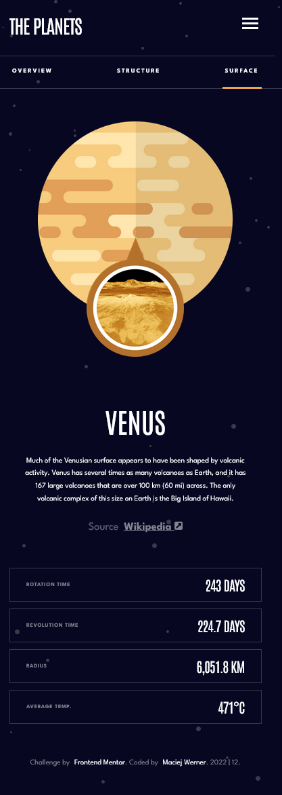
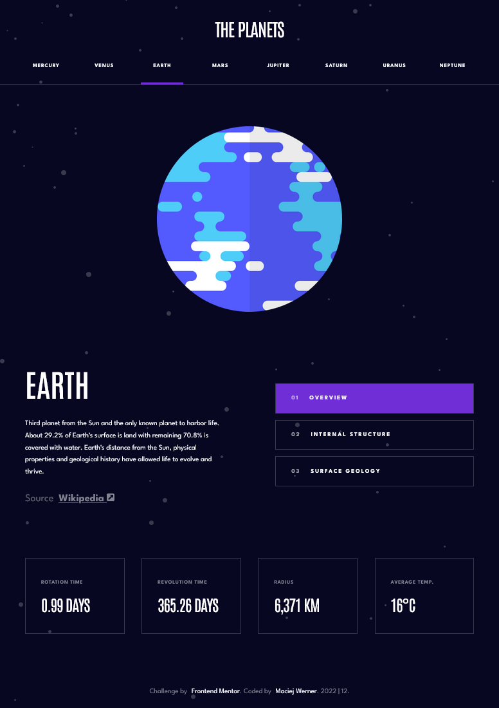
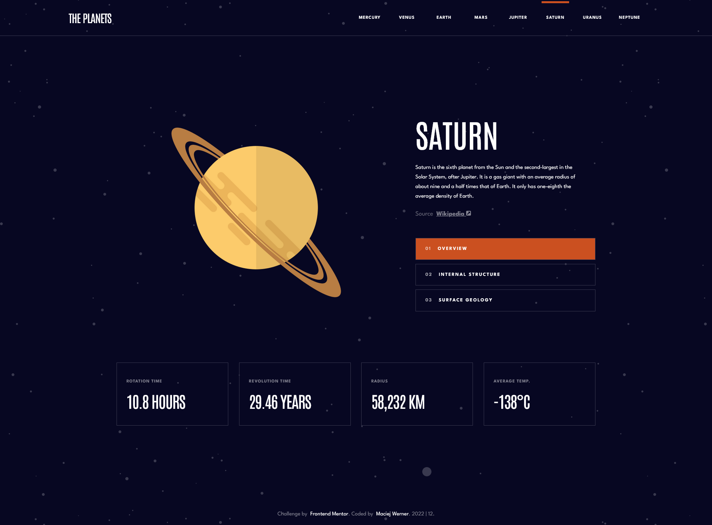

# Frontend Mentor - Planets fact site solution

This is a solution to the [Planets fact site challenge on Frontend Mentor](https://www.frontendmentor.io/challenges/planets-fact-site-gazqN8w_f). Frontend Mentor challenges help you improve your coding skills by building realistic projects. 

## Table of contents

- [Frontend Mentor - Planets fact site solution](#frontend-mentor---planets-fact-site-solution)
  - [Table of contents](#table-of-contents)
  - [Overview](#overview)
    - [The challenge](#the-challenge)
  - [Screenshot](#screenshot)
    - [Links](#links)
  - [My process](#my-process)
    - [Built with](#built-with)
    - [What I learned](#what-i-learned)
    - [Continued development](#continued-development)
  - [Author](#author)

## Overview

### The challenge

Users should be able to:

- View the optimal layout for the app depending on their device's screen size
- See hover states for all interactive elements on the page
- View each planet page and toggle between "Overview", "Internal Structure", and "Surface Geology"

## Screenshot
| Mobile | Tablet | Desktop |
|--------|--------|---------|
|        |       |         |

### Links

- Solution URL: [@github](https://github.com/maciejwerner/planets-fact-site)
- Live Site URL: [@github pages](https://maciejwerner.github.io/planets-fact-site/)

## My process

### Built with

- Vanilla HTML
- Vanilla JS
- SCSS - 7 -1 approach
- CSS Grid
- CSS Flexbox

### What I learned

The project was more difficult and took me more time than I thought. I added an animation of the components that appear on the screen.

### Continued development

I'm going to create more apps to get more confidence and speed.

## Author

- Frontend Mentor - [Maciej Werner](https://www.frontendmentor.io/profile/maciejwerner)